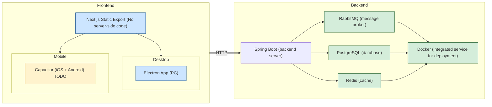

# Lumiroom
(I have to say, the name is undetermined, it is just a random name after asking gpt)

(but the following is the real tech docs)

## structure:



## APIs:
docs TDB

## Message

types (I'll use the ts version as it is shorter)

```typescript
export type MessageScope = "public" | "personal";
export type MessageType = "message" | "invite" | "greeting";

export interface Message {
  id: string;  // UUID for unique message ID
  speaker: string;  // ID of the speaker
  speaker_name: string;  // Name of the speaker
  chat_message: string;  // The actual chat message
  created_at: string;  // Timestamp when the message was created
  chat_room_id: string;  // Unique ID for the chatroom
  metadata: {
    scope: MessageScope,
    type: MessageType,
    data: unknown // not any as eslint unhappy, this should be any data, if taking all possible and future circumstances
  }
}
```

note, since uuid->string is kind of troublesome, currently done in all strings, will refactor afterward

### normal messages

just normal, nothing special

```json
{
  "id": "91982580-564d-44f5-af94-95fe01de77eb",
  "speaker": "dd1631e4-abf2-4514-9dbf-b7e2d641d0f9",
  "speaker_name": "someone",
  "chat_message": "hello",
  "created_at": "2025-08-23T15:00:00Z",
  "chat_room_id": "1d7ef0b5-46d3-46a5-a794-e528931928c0",
  "metadata": {
    "scope": "public",
    "type": "message",
    "data": {} // null
  }
}
```

- id: message uuid
- speaker: speaker uuid
- speaker_name: speaker name, so we dont need to fetch the users for every message
- chat_message: the message
- created_at: the time this is send
- chat_room_id: room uuid
- metadata
  - scope: public, no need to hide this
  - type: message
  - data: empty, we use the speaker field to know who send this

#### personal messages

direct 1-to-1 messages

```json
{
  "id": "91982580-564d-44f5-af94-95fe01de77eb",
  "speaker": "dd1631e4-abf2-4514-9dbf-b7e2d641d0f9",
  "speaker_name": "someone",
  "chat_message": "hello",
  "created_at": "2025-08-23T15:00:00Z",
  "chat_room_id": "",
  "metadata": {
    "scope": "personal",
    "type": "message",
    "data": {
      "receiver": "dd1631e4-abf2-4514-9dbf-b7e2d641d0f8"
    } // null
  }
}
```

- id: message uuid
- speaker: speaker uuid
- speaker_name: speaker name, so we dont need to fetch the users for every message
- chat_message: the message
- created_at: the time this is send
- chat_room_id: "", this done have a roomId
- metadata
  - scope: public, no need to hide this
  - type: message
  - data: 
    - receiver: the uuid of the receiver


### greetings

this is used to add personal contacts, the user should at least send his/her id to the other user, will consider whether add all the details or just include the id and fetch in database

```json
{
  "id": "91982580-564d-44f5-af94-95fe01de77eb",
  "speaker": "dd1631e4-abf2-4514-9dbf-b7e2d641d0f9",
  "speaker_name": "someone",
  "chat_message": "Hi Bob, I added you as a contact! Looking forward to connecting.",
  "created_at": "2025-08-23T15:00:00Z",
  "chat_room_id": "",
  "metadata": {
    "scope": "personal",
    "type": "greeting",
    "data": {} // null, since the speaker field contains this
  }
}
```

- id: message uuid
- speaker: speaker uuid
- speaker_name: speaker name, so we dont need to fetch the users for every message
- chat_message: the message
- created_at: the time this is send
- chat_room_id: ""
- metadata
  - scope: personal, greetings are used to add contacts, so the message is personal
  - type: greeting
  - data: empty, we use the speaker field to know who send this

#### accept greeting:

this is used as to inform that the user accepts the greeting, this is the point where the contact is set

```json
{
  "id": "91982580-564d-44f5-af94-95fe01de77eb",
  "speaker": "dd1631e4-abf2-4514-9dbf-b7e2d641d0f9",
  "speaker_name": "someone",
  "chat_message": "Hi A, I accepted your invitation",
  "created_at": "2025-08-23T15:00:00Z",
  "chat_room_id": "", /// this does not matter,
  "metadata": {
    "scope": "personal",
    "type": "accept greeting",
    "data": {
      "room_id": "some uuid" // for unification, we see such 1-to-1 chats also as rooms, the room_id has to be requested from psql
    } // null, since the speaker field contains this
  }
}
```

- id: message uuid
- speaker: speaker uuid
- speaker_name: speaker name, so we dont need to fetch the users for every message
- chat_message: the message
- created_at: the time this is send
- chat_room_id: ""
- metadata
  - scope: personal, greetings are used to add contacts, so the message is personal
  - type: greeting
  - data: empty, we use the speaker field to know who send this

### invitation

we separate this from the greetings, this is used, say, when user A creates a group with A,B,C, a messages is send to B,C(assume created by A), to inform they are invited in the group, and also, in the future, when one joins the group using some link, this should be send to the entire room

```json
{
  "id": "91982580-564d-44f5-af94-95fe01de77eb",
  "speaker": "dd1631e4-abf2-4514-9dbf-b7e2d641d0f9",
  "speaker_name": "someone",
  "chat_message": "You've been invited to the group 'Weekend Plans'. Join us here!",
  "created_at": "2025-08-23T16:10:00Z",
  "chat_room_id": "1d7ef0b5-46d3-46a5-a794-e528931928c0",
  "metadata": {
    "scope": "public",
    "type": "invite",
    "data": null // we dont need any data, we look up the group based on the chat_room_id
  }
}
```

- id: message uuid
- speaker: speaker uuid
- speaker_name: speaker name, so we dont need to fetch the users for every message
- chat_message: the message
- created_at: the time this is end
- chat_room_id: room uuid
- metadata
  - scope: public, no need the hide this
  - type: invite
  - data: 
    - creator_id: the creator of the group


like wechat and whatsapp, I dont think we should wait for the other end to accept this invite

## file storage conventions

### users and rooms:

all the data is stored under 

```.env
NEXT_PUBLIC_STORAGE_PATH_DEV="D:/Desktop/study/projects/DRP/storage" # for electron dev on local machine
NEXT_PUBLIC_STORAGE_PATH_PROD="./storage" # use relative path to resolve permission issues and maintain cross-platform consistency
```

the layout is 

{STORAGE_PATH}/<userid>/<rooms>.jsonl, or {STORAGE_PATH}/<userid>/<special>.jsonl

### {STORAGE_PATH}/<userid>/groups.jsonl:

this is used to find all the groups that should exist on the machine

file format: jsonl

data format: refer to the following type:

```typescript
export interface Group {
  id: string;
  name: string;
  last_message: Message | null;
  unread: number;
  created_at: string;
  creator_id: string;
  // members: SupabaseUser[]; // members should be fetched from backend for safety
}
```

### {STORAGE_PATH}/<userid>/contacts.jsonl

this is used to find all the contacts that should exist on the machine

file format: jsonl

data format: refer to the following type

```typescript
export interface SupabaseUser {
  id: string;
  username: string;
  onboarding_complete: boolean;
  avatar_id: number;
  created_at?: string;
  email: string; // since supabase only supports email/password auth, this is required
}
```

### {STORAGE_PATH}/<userid>/pending.jsonl

this is used for those who send a friend request, but the user has not replied whether to accept this greeting

file format: jsonl

data format: refer to the following type

```typescript
{
  user: SupabaseUser // please see the type above in contacts.jsonl
  last_msg: Message // please see the type above in the messages section
}
```

### {STORAGE_PATH}/<userid>/<groupid>.jsonl

this is used to store the group data

file format: jsonl

data format: refer to the following type

```typescript
Message // please see the type above in the messages section
```

may add encryption for the file in future versions for safety

## WARNINGS FOR DEVELOPERS:
1. electronStore store the data somewhere in AppData with the app's name, so C:/Users/<user>/AppData/.../<appname>, delete the Cache folder would reset everythin
2. capacitor loads strangely, eg. if you have a / page and /auth page, loading /auth will also trigger the / useEffect, so if the useEffect involves redirecting, infinite loop, solution, check pathname, if no match return, (need to do this for every page for safety issues)
3. the backend is deployed on aws, registered domain name and configured https for lumiroom.duckdns.org, but the aws ec2 instance must be running to access through ssh

## TODO:
1. [ ] add security check, even if there is a record of user and jwt in the store, send a extra request to see if the user information is valid
2. [ ] add back button on the lobby(wasted)
3. [ ] allow user search in contacts (need a extra api)


