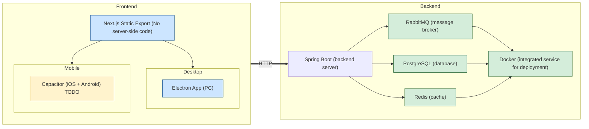

# Lumiroom
(I have to say, the name is undetermined, it is just a random name after asking gpt)

(but the following is the real tech docs)

## structure:

## APIs:
docs TDB

## Message

## WARNINGS FOR DEVELOPERS:
1. electronStore store the data somewhere in AppData with the app's name, so C:/Users/<user>/AppData/.../<appname>, delete the Cache folder would reset everythin
2. capacitor loads strangely, eg. if you have a / page and /auth page, loading /auth will also trigger the / useEffect, so if the useEffect involves redirecting, infinite loop, solution, check pathname, if no match return, (need to do this for every page for safety issues)
3. the backend is deployed on aws, registered domain name and configured https for lumiroom.duckdns.org, but the aws ec2 instance must be running to access through ssh

## TODO:
1. [ ] add security check, even if there is a record of user and jwt in the store, send a extra request to see if the user information is valid
2. [ ] add back button on the lobby(wasted)
3. [ ] allow user search in contacts (need a extra api)

