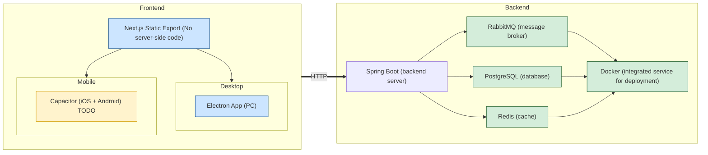

# Lumiroom
(I have to say, the name is undetermined, it is just a random name after asking gpt)

(but the following is the real tech docs)

## structure:

```mermaid
---
config:
  layout: dagre
---
flowchart LR
  subgraph Frontend["Frontend"]
    FE["Next.js Static Export (No server-side code)"]
    subgraph Desktop["Desktop"]
      EL["Electron App (PC)"]
    end
    subgraph Mobile["Mobile"]
      CAP["Capacitor (iOS + Android) TODO"]
    end
  end
  subgraph Backend["Backend"]
    SB["Spring Boot (backend server)"]
    DO["Docker (integrated service for deployment)"]
    MQ["RabbitMQ (message broker)"]
    DB["PostgreSQL (database)"]
    RED["Redis (cache)"]
  end
  %% FE -- HTTP/HTTPS --> SB
  FE --> Desktop & Mobile
  Frontend ==HTTP==> SB
  SB --> MQ & DB & RED
  MQ & DB & RED --> DO
  FE:::frontend
  EL:::frontend
  CAP:::todo
  DO:::backend
  MQ:::backend
  DB:::backend
  RED:::backend
  classDef todo fill:#fff3cd,stroke:#d39e00
  classDef backend fill:#d4edda,stroke:#155724
  classDef frontend fill:#cce5ff,stroke:#004085
```

## APIs:
docs TDB

## Message